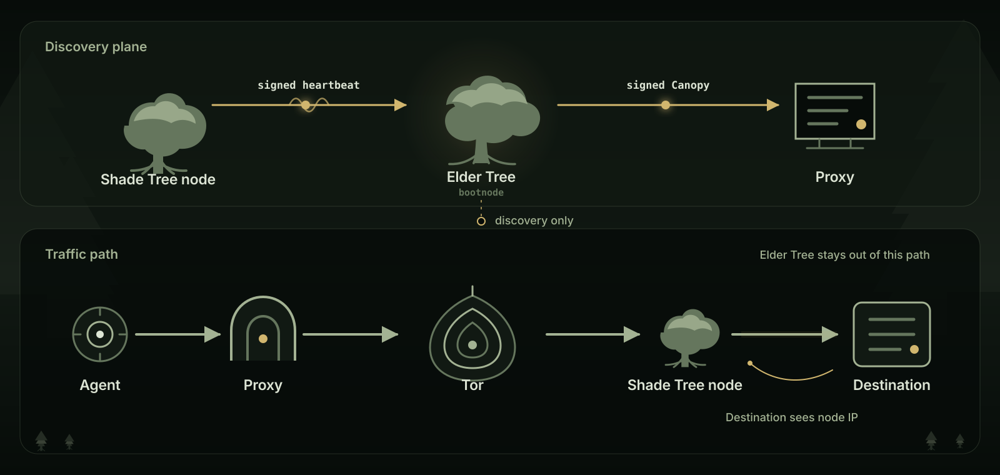

# Shade Tree

Cover for local agents.

[![CI][ci-badge]][ci-url]
[![real Tor E2E][e2e-badge]][e2e-url]
[![release][release-badge]][release-url]
[![MIT][license-badge]][license-url]

Run the proxy beside an agent. Run a Shade Tree node to provide cover. The two
sides meet through a proof-gated Tor onion service, one admitted HTTPS tunnel
at a time.

[Site][site] · [Grove][grove] · [Research][research-note] · [Docs](docs/README.md) ·
[Protocol](docs/PROTOCOL.md) · [Security](SECURITY.md)

> [!WARNING]
> Research preview. The code is unaudited and the included ZK artifacts are for
> development. The checked-in Sepolia records describe the retired pre-v4
> research fleet. Do not rely on this preview for real funds or sensitive use.

## Agent developers

The npm package is not published yet. Install the Proxy from a checkout, then
start Tor and an operator-supplied v4 profile:

```bash
git clone https://github.com/dmarzzz/shade-tree-node.git
cd shade-tree-node
npm ci && npm link
bash scripts/start-tor-client.sh

SHADE_TREE_SECRET=<admitted-member-secret> \
SHADE_TREE_BOOTNODE_ONION=<v4-elder.onion> \
SHADE_TREE_DIR_SIGNER=<pinned-canopy-signer> \
  shade-tree proxy --tor-port 9260
```

In another terminal, route only the agent process:

```bash
shade-tree run -- your-agent
```

`shade-tree run` passes proxy variables only to its child and refuses to launch
if the Proxy is down. Software that ignores proxy variables can use
`http://127.0.0.1:8888` directly. Agents that own their networking can import
[`ShadeTreeClient`](docs/SDK.md) from the checkout instead. There is no
repo-maintained public v4 connection profile yet; obtain enrollment, the Elder
onion, and its signer pin from the operator you intend to use.

## How it works

<picture>
  <source media="(max-width: 560px)" srcset="docs/post/fig/shade-tree-path-mobile.svg" type="image/svg+xml" width="720" height="1710">
  
</picture>

Shade Tree is a Tor-based egress layer. Tor keeps the Proxy source IP out of the
node application connection. Each CONNECT tunnel carries a Groth16 RLN proof
that a rate-commitment leaf belongs to an admitted Merkle root without revealing
which leaf. The proof binds the target-and-nonce signal to a private per-epoch
message slot. The node verifies it before egress and uses epoch-scoped
nullifiers to enforce its view of the member's tunnel limit.

## Roles

| Name | What it does |
| --- | --- |
| Proxy | Runs beside the agent, reads the signed Canopy, and opens each tunnel through Tor |
| Shade Tree node | Verifies the proof and makes the destination-facing connection |
| Elder Tree | The bootnode that caches signed announcements and serves the Canopy |
| Canopy | The signed directory of announced nodes |
| Grove | The network of Shade Tree nodes |

The Elder Tree is outside the traffic path. Its pinned signer is a discovery
authority: clients trust it to choose the candidate list. A compromised signer
can omit, reorder, or add entries. It cannot make an existing onion terminate
at a different key, and capabilities remain verifiable when their onion-signed
advertisement is present. Code and wire docs keep `client`, `gateway`,
`bootnode`, and `directory` where compatibility matters.

[Tor exit addresses are public][tor-exit-list], and [shared traffic often trips
abuse controls][tor-captchas]. Shade Tree gates each tunnel and publishes no
egress-IP list. Destinations still see and can block a node IP.

## Run a node

A Shade Tree node is a Tor onion service with a proof-gated CONNECT gateway.
Its public IP becomes the destination-facing egress IP.

Do not expose the current node on a public or private-network-connected host.
[Issue #73](https://github.com/dmarzzz/shade-tree-node/issues/73) leaves private
and link-local destinations reachable through the default egress policy. Node
deployment stays blocked until that guard and the other [deployment
gates](docs/DEPLOYMENT-PLAN.md) are closed.

A node can run near GPU workers, model servers, or an Ethereum validator. Give
egress a dedicated public IP when possible. Keep validator keys and
authenticated RPC endpoints out of the node. Read the [operator
guide](docs/OPERATOR.md) and current [deployment plan](docs/DEPLOYMENT-PLAN.md).

Interactive services grow one small ASCII tree when ready. Bootstrap installs
use structured JSON logs and separate loopback metrics for each role. See the
[monitoring guide](monitoring/README.md).

## Boundaries

- The destination sees the node IP and can share or block it.
- The node sees the destination hostname, port, timing, and byte counts. With
  HTTPS it does not terminate application TLS.
- Tor does not stop an observer who can watch both ends from correlating timing.
- Enrollment through staked or paid sets can create public onchain links.
- A node can refuse, delay, truncate, or misroute a valid tunnel.
- Co-located services keep separate trust boundaries only if the operator does.
- Replay and rate accounting are strongest per node. The optional cross-node
  tally is fail-open.

One proof admits one CONNECT tunnel, not one HTTP request. HTTP/2 and keep-alive
can carry many requests inside it. Read the [protocol](docs/PROTOCOL.md) and
[threat model](docs/THREAT-MODEL.md) for the exact guarantees.

## Repository

| Path | Role |
| --- | --- |
| [`client/`](client/) | Local proxy, discovery, and node rotation |
| [`gateway/`](gateway/) | Proof gate and destination tunnel |
| [`bootnode/`](bootnode/) | Elder Tree discovery service and operator tools |
| [`rust/`](rust/) | Rust client, protocol crate, and RLN prover |
| [`contracts/`](contracts/) | Optional Sepolia membership and operator sets |
| [`network/`](network/) | Signed test-network records |

```bash
npm ci
npm test
(cd rust && cargo test --workspace)
```

See [CONTRIBUTING.md](CONTRIBUTING.md) for the test layout. Report security
issues through the private channel in [SECURITY.md](SECURITY.md). Ask questions
in [Discussions](https://github.com/dmarzzz/shade-tree-node/discussions). Shade
Tree is open source under the [MIT license](LICENSE).

[ci-badge]: https://github.com/dmarzzz/shade-tree-node/actions/workflows/ci.yml/badge.svg
[ci-url]: https://github.com/dmarzzz/shade-tree-node/actions/workflows/ci.yml
[e2e-badge]: https://github.com/dmarzzz/shade-tree-node/actions/workflows/real-tor-e2e.yml/badge.svg
[e2e-url]: https://github.com/dmarzzz/shade-tree-node/actions/workflows/real-tor-e2e.yml
[release-badge]: https://img.shields.io/github/v/release/dmarzzz/shade-tree-node
[release-url]: https://github.com/dmarzzz/shade-tree-node/releases/latest
[license-badge]: https://img.shields.io/badge/license-MIT-59624f.svg
[license-url]: LICENSE
[site]: https://shade-tree-node.vercel.app
[grove]: https://shade-tree-node.vercel.app/grove/
[research-note]: https://shade-tree-node.vercel.app/research/
[tor-exit-list]: https://support.torproject.org/abuse/ban-tor/
[tor-captchas]: https://support.torproject.org/tor-browser/encountering-issues/captchas/
