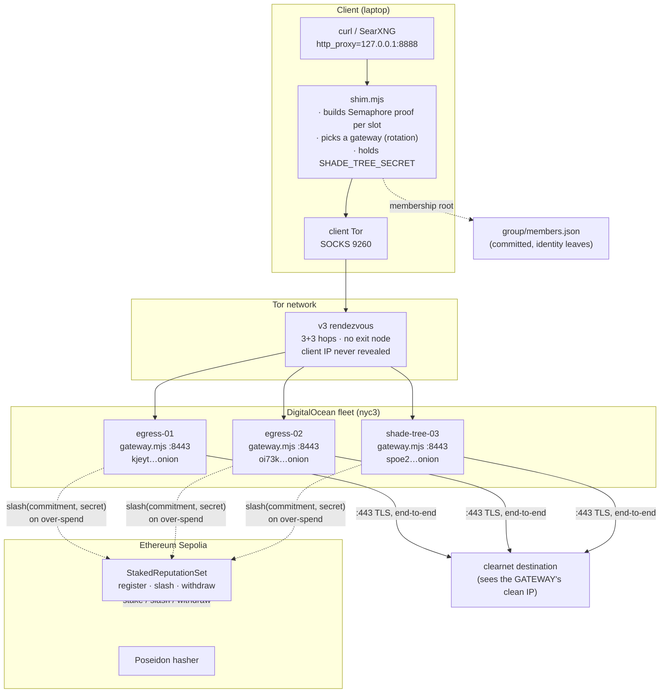
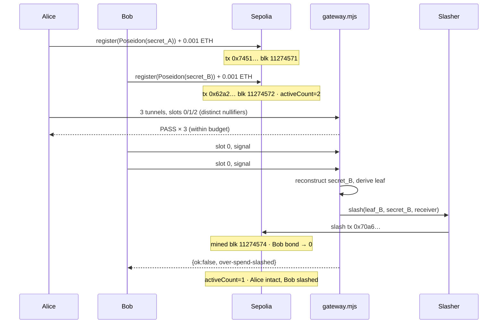
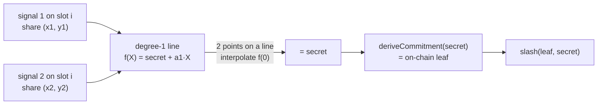

# End-to-end run report — Shade Tree on Sepolia

**One document, the whole system, every flow.** This is the comprehensive record of a
live end-to-end run: contracts on Ethereum Sepolia, a 3-gateway Tor fleet on
DigitalOcean, and the full protocol exercised both on-chain (stake → use → over-spend →
slash) and over live Tor (client → rendezvous → gateway → clearnet). Every address, tx,
onion, and hop is here, with the flows drawn out.

- **Status:** live and verified, both the on-chain economics and the Tor transport.
- **Network:** Ethereum Sepolia (chainId 11155111) + Tor + DigitalOcean nyc3.
- **Companion artifacts:** [`contracts.json`](contracts.json), [`directory.json`](directory.json),
  [`integration-report.md`](integration-report.md) (the on-chain slash trace),
  [`../../docs/DEPLOYMENT.md`](../../docs/DEPLOYMENT.md) (runbook), and the design docs
  ONCHAIN / FLEET / LIGHT-CLIENT / NEXT-VERSION.

---

## 1. TL;DR — what was proven

| Property | How it was proven | Evidence |
|---|---|---|
| Staking is real & on-chain | 2 members registered bonds on Sepolia | `activeCount` 0→2, tx `0x7451…`, `0x62a2…` |
| Anonymous outbound tunnel works | client builds a ZK proof, gateway verifies, egresses | live round-trip returns the **gateway's** IP |
| Per-tunnel rotation (gateway + slot) | 3 tunnels spread across gateways + slots | egress-02→shade-tree-03, slots 0/1/2 |
| Client stays anonymous to the gateway | rendezvous hides the client IP | laptop IP appears **0×** in gateway logs |
| Over-spend is detected & punished | gateway reconstructs the secret, slashes on-chain | slash tx `0x70a6…`, bond zeroed |
| Honest members are never exposed | only the over-spender's leaf is revealed | alice bond intact, still `active` |

Final on-chain state now: `activeCount = 1` (alice staked, bob slashed).

---

## 2. System architecture



Two planes, deliberately separate:

- **Membership plane (gating):** the client proves membership in `group/members.json`
  (Semaphore identity leaves) in zero knowledge; the gateway verifies and gates. No IP,
  no identity.
- **Economic plane (staking/slashing):** bonds and slashing settle on the Sepolia
  `StakedReputationSet`. The gateway is the only bridge — on a proven over-spend it
  reconstructs the secret and submits a slash.

Why two planes and not one tree: the membership leaf is `Poseidon(EdDSA-pubkey(secret))`
and the slashable leaf is `Poseidon(secret)` — different functions, unifiable only by an
RLN circuit (see §9). Today they are bridged off-chain by the shared secret.

---

## 3. Cast of characters (every identity in the run)

### Contracts (Sepolia, deployed block 11274471)

| Contract | Address |
|---|---|
| **StakedReputationSet** | [`0x35719A477655A5Aaac7A2aAA11A3167eFa3398EC`](https://sepolia.etherscan.io/address/0x35719A477655A5Aaac7A2aAA11A3167eFa3398EC) |
| MockCommitmentHasher (Poseidon(secret)) | `0xB9c051d12750395e7541Da149e216B1542b343d2` |
| MockWithdrawVerifier | `0xac506585D70F8DA91C38CF271938Ee956f7CB862` |

Params: bond **0.001 ETH**, unbonding **300 s** (≥ F+E+C), epoch **120 s**, K **8** slots.

### Wallets

| Role | Address | Purpose |
|---|---|---|
| Deployer | `0x3261DaF3672Dc8E6063b6960C161Fdc8a6Fc2ff7` | deployed the stack; funded members |
| Gateway slasher (hot key) | `0xc8606C75E003EDA7C0a377B4708AbEC6EB7a7f02` | submits slash tx; receives forfeited bonds |
| Alice staking wallet | `0x2ec9838Ea920Dc33D2771F4d29CBF6e7784929F9` | honest member |
| Bob staking wallet | `0xaaa30436B0710F918A2Cd63adF3878275b21325c` | the over-spender |

### Member leaf commitments (Poseidon(secret), the on-chain stake key)

- **Alice:** `5373848055890838055556410403704171411869276357529468527372048700194690753725`
- **Bob:** `1342145485235026862373887201719715173170572758563187098074062514164623346192`

### The fleet

| Gateway | DO droplet | IPv4 | Onion |
|---|---|---|---|
| gateway-1 | egress-01 | 165.227.118.154 | `kjeyt2gtzcvnbshedns5wvtahtqbqwlmw4e56ku3iuqiykf5mwwdqdad.onion` |
| gateway-2 | egress-02 | 167.172.224.177 | `oi73kttiriqhfmoxo42pstfobrhbjxko3gzzs54bovwhs2ayuw64imad.onion` |
| gateway-3 | shade-tree-03 | 167.172.237.22 | `spoe2hmwp62w5bg74by7plx54rn4rzjro4bq6qzv5q6ewi4lqlovlbqd.onion` |

Directory signer (pinned in client as `SHADE_TREE_DIR_SIGNER`):
`189f4511bad18f7d9e1fa1339b8b7ac27a7920ddf27b9a9c286b599bc0b21321`.

---

## 4. The tunnel lifecycle (a single normal tunnel, hop by hop)

```mermaid
sequenceDiagram
    participant App as curl/agent
    participant Shim as shim.mjs
    participant Pool as slot pool
    participant Tor as Tor rendezvous
    participant GW as gateway.mjs
    participant Dest as destination

    App->>Shim: CONNECT host:443
    Shim->>Pool: nextSlot()  (rotate slot i, 0..K-1)
    Shim->>Shim: signal = H(target, nonce)  (deterministic, reused on retry)
    Shim->>Shim: proveForSlot(secret, epoch, i, signal)<br/>→ Semaphore proof + nullifier + RLN share
    Shim->>Shim: pick gateway (weighted-random over fleet)
    Shim->>Tor: SOCKS connect <onion>:80  (3+3 hops)
    Tor->>GW: rendezvous (client IP hidden)
    Shim->>GW: envelope v2 {target, slot, proof, nullifier, scope, share}
    Note over GW: cheap-first checks:<br/>1 scope valid slot?<br/>2 root ∈ recent-roots?<br/>3 SNARK verifyProof<br/>4 share dedup / over-spend?
    GW->>GW: spend(scope, nullifier, share)
    alt within budget
        GW->>Dest: TCP connect :443 from gateway IP
        GW-->>Shim: {ok:true}
        App->>Dest: TLS handshake (end-to-end; gateway sees only host:port)
        Dest-->>App: response (source IP = gateway)
    else over-spend (2nd distinct signal on a slot)
        GW->>GW: reconstruct secret from 2 shares → derive leaf
        GW->>GW: slash(commitment, secret) on Sepolia
        GW-->>Shim: {ok:false, over-spend-slashed}
    end
```

The envelope on the wire (v2):

```json
{ "v": 2, "target": "host:443", "slot": 3,
  "proof": { "merkleTreeRoot": "…", "nullifier": "…", "scope": "…", "message": "…", "points": [...] },
  "nullifier": "…", "scope": "H(epoch,slot)", "share": { "x": "H(signal)", "y": "…" } }
```

---

## 5. The on-chain flow: stake → use → over-spend → slash

This is the [integration test](integration-report.md) (`scripts/integration-sepolia.mjs`),
run against live Sepolia + the real gateway. Timestamps are elapsed from t0; full trace in
the companion report.



### Transaction ledger

| Step | Tx | Block | Result |
|---|---|---|---|
| Alice stake | [`0x7451c24c…5c64`](https://sepolia.etherscan.io/tx/0x7451c24c8777cad45dfbb13ebc110f51c115bd6bcce24306a10efdce9fc35c64) | 11274571 | bond held |
| Bob stake | [`0x62a2eafc…b5f5`](https://sepolia.etherscan.io/tx/0x62a2eafc8b38a490f7112cb7541da3bd88aea7d354fe8f116700bd1cec1ab5f5) | 11274572 | bond held, activeCount=2 |
| **Slash (Bob)** | [`0x70a67009…d6b9`](https://sepolia.etherscan.io/tx/0x70a670093401b4675d3535d9738675928a3949b8858beac4daa20691c831d6b9) | 11274574 | Bob bond → 0, paid to slasher |

Timing (elapsed): Alice staked +9.8s, Bob staked +19.1s, 3 honest tunnels +20–21s
(round-trips 67–250ms), over-spend detected +21.7s, slash mined +55.6s, verified +56.3s.

---

## 6. How slashing stays anonymous (the RLN mechanism)

The tension: to slash a specific spammer you must name their leaf, but the whole system
hides the leaf. RLN resolves it with Shamir shares.



- **≤ K signals/epoch** (one per slot) reveal one point each → **nothing** leaks (a line
  needs 2 points).
- **A 2nd distinct signal on the same slot** is the rate violation → 2 points → the line's
  constant term (the secret) is reconstructable → the leaf → the slash.
- So **cheating is the only thing that deanonymizes you**, and only to your pseudonymous
  leaf, never a real identity. The gateway is the single verifier that holds the shares
  (no public gossip needed). PoC fidelity: the share is carried in JS, not yet ZK-bound to
  the membership proof — that binding is the RLN circuit (§9).

---

## 7. The live Tor round-trip (transport, confirmed)

Full path, laptop → clearnet, with both rotations visible:

| req | egress IP (gateway) | onion | slot |
|---|---|---|---|
| 1 | 167.172.224.177 (egress-02) | oi73ktti… | 0 |
| 2 | 167.172.224.177 (egress-02) | oi73ktti… | 1 |
| 3 | 167.172.237.22 (shade-tree-03) | spoe2hmw… | 2 |

- The destination sees the **gateway's** clean IP, not the laptop's.
- **Privacy check:** the laptop's public IP (`67.245.238.193`) appears **0 times** in the
  gateways' logs — Tor rendezvous never reveals the client.
- Both rotations are live: gateway changed (egress-02 → shade-tree-03) and slot advanced per
  tunnel (distinct per-tunnel nullifiers).

---

## 8. Debugging journey (bugs found and fixed this run)

Every one of these is committed; the run flushed out real defects, not config noise.

| # | Symptom | Root cause | Fix (commit) |
|---|---|---|---|
| 1 | client hangs forever, no reply | `verifyEnvelope` did `.map` on `recentRoots`, a **Set** → TypeError thrown outside the gateway try/catch → no reply | `Array.from()`; gateway replies on any throw; shim readLine timeout (`e58d224`) |
| 2 | slashing silently dry-run | `makeSlasher` read `deployed.StakedReputationSet` but Deploy writes `stakedReputationSet` (lowercase) | key casing fixed (`9c16f67`) |
| 3 | can't enable fleet slashing without breaking membership | one env var flipped both slashing **and** on-chain root mode | added `SHADE_TREE_SLASH_CONTRACT`, decoupled (`0e50d56`) |
| 4 | env template crash `int has no len()` | a `0x`+64-hex key is a valid YAML integer; sops re-parsed it to an int | store bare hex, prepend `0x` in group_vars (devops) |
| 5 | fleet round-trip `HostUnreachable` | directory onions carry `.onion`; `dialOnion` re-appends → `…onion.onion` | strip suffix in the directory path (`45dd65c`) |
| 6 | laptop can't reach fleet onions (but reaches DuckDuckGo) | gateways required Tor **PoW**; laptop's Homebrew tor is `pow: no` | PoW default OFF (`shade_tree_enable_pow`, devops) |
| 7 | intermittent onion unreachability | onion **cold-start**: each re-provision restarts tor; descriptor needs minutes to republish | latency, not a fault; `dialOnion` retries cover steady state |

Note on the misdiagnosis worth recording: #5–#7 initially read as "the Tor network is
broken." It was not — a long-running tor reached DuckDuckGo's onion throughout. The real
causes were a client bug (#5), a capability mismatch (#6), and restart latency (#7).

---

## 9. What is proven vs. the documented seams

**Proven live:** on-chain staking, anonymous outbound tunnels, per-tunnel gateway + slot
rotation, client-IP privacy, over-spend detection, secret reconstruction, on-chain
slashing, time-locked exit/withdraw (in the anvil e2e), and the full Tor transport.

**Honest seams (by design, documented, not hidden):**

1. **Membership is not yet sourced from the chain.** Gateways gate on `members.json`
   (identity leaves); the stake leaf is `Poseidon(secret)`. Unifying "stake → automatically
   a recognized member" with working slashing requires the **RLN circuit** (one leaf
   function for both), because nothing binds two separate commitments to one secret without
   a ZK proof. This is the headline follow-up.
2. **RLN at PoC fidelity.** The Shamir share is carried in JS and bound to the proof only
   by a shared secret + a cheap `signal == share.x` check, not a single Groth16 proof.
   Production adopts the `rate-limiting-nullifier` circuit.
3. **Mock verifier/hasher.** `MockWithdrawVerifier` accepts a revealed secret (not ZK);
   `MockCommitmentHasher` is `Poseidon(secret)`. Testnet-only until the real artifacts land.
4. **Directory is public.** The onion list is committed (git as the channel). A public
   fleet list is enumerable (adversarial-review #10); the members-only / on-chain-registry
   directory with service staking is the FLEET.md follow-up.

---

## 10. Reproduce it

```bash
# Contracts (Sepolia) — deployer must hold a little Sepolia ETH
export SHADE_TREE_RPC_URL=https://ethereum-sepolia-rpc.publicnode.com
export SHADE_TREE_BOND_WEI=1000000000000000 SHADE_TREE_UNBONDING=300 SHADE_TREE_MIN_UNBONDING=270
forge script script/Deploy.s.sol:Deploy --rpc-url "$SHADE_TREE_RPC_URL" --broadcast --private-key <deployer>

# On-chain integration test (stake → use → over-spend → slash)
node scripts/integration-sepolia.mjs

# Live Tor round-trip through the fleet
export SHADE_TREE_DIRECTORY=network/sepolia/directory.json
export SHADE_TREE_DIR_SIGNER=189f4511bad18f7d9e1fa1339b8b7ac27a7920ddf27b9a9c286b599bc0b21321
export SHADE_TREE_SECRET=<a seeded member secret>
bash scripts/run-client.sh
curl -x http://127.0.0.1:8888 https://api.ipify.org?format=json   # returns a gateway IP
```

Fleet provisioning + on-chain slashing wiring live in `~/agent-devops`
(`shade_tree_gateway` role, branch `shade-tree-gateway-fleet`).

---

## 11. Session commit chain (the work, in order)

```
8c93edd  feat: on-chain staked reputation set + slashing + fleet rotation (next version)
d060fc4  deploy: live 3-gateway fleet + sepolia network artifacts
dbbbad8  deploy: StakedReputationSet live on Sepolia
e58d224  fix: verifyEnvelope accepts a Set of roots; gateway never hangs the client
9c16f67  test: live Sepolia integration (stake → use → over-spend → slash) + report
2239d02  docs: protocol design + build report + live experiment harnesses
0e50d56  feat: decouple on-chain slashing from membership root mode (SHADE_TREE_SLASH_CONTRACT)
45dd65c  fix: strip .onion suffix in directory dial path (double-suffix HostUnreachable)
c28439c  docs: live Tor round-trip confirmed; record the 3 root causes
```
(agent-devops: `shade_tree_gateway` role + fleet slashing + PoW-off on branch `shade-tree-gateway-fleet`.)
